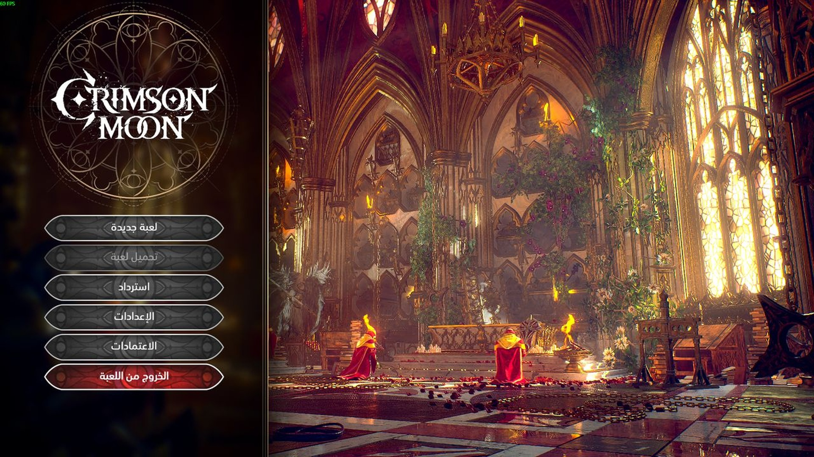
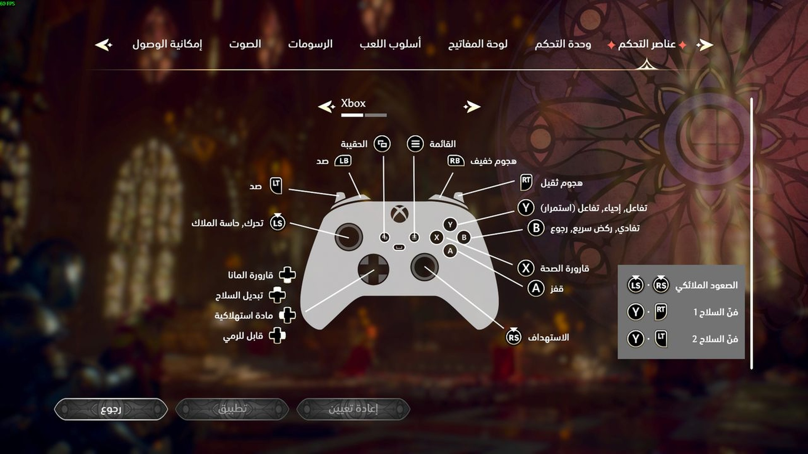
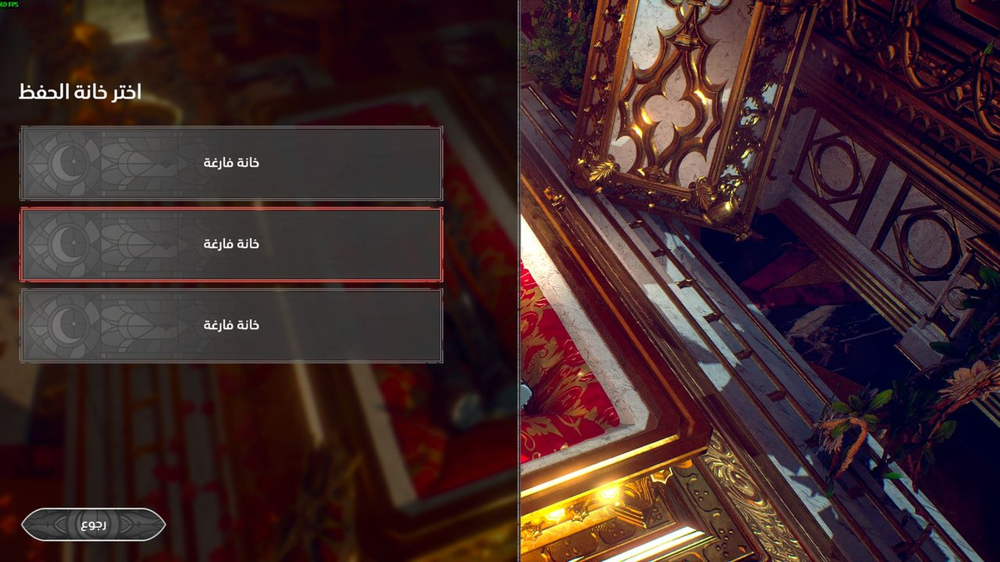
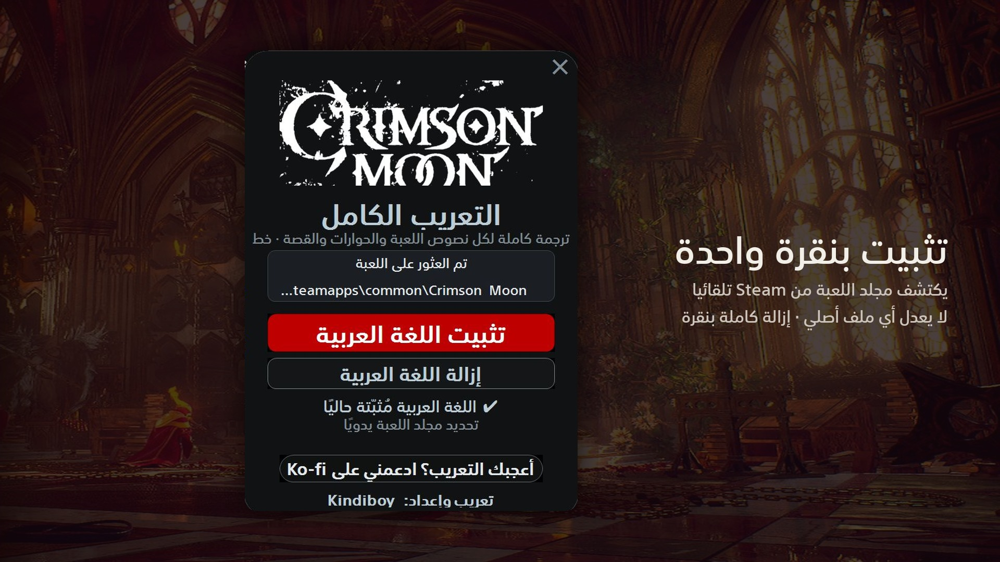

<h1 align="center">Crimson Moon — التعريب الكامل</h1>

Complete Arabic localization for <b>Crimson Moon</b> (Steam) · تعريب كامل للعبة

  <a href="https://github.com/faisalkindi/CrimsonMoon-Arabic/releases/latest/download/CrimsonMoon_Arabic_Installer.zip"><b>⬇ تحميل المثبّت / Download installer</b></a>
  &nbsp;·&nbsp;
  <a href="https://github.com/faisalkindi/CrimsonMoon-Arabic/releases/latest/download/CrimsonMoon_Arabic_Manual.zip">ملفات التثبيت اليدوي / Manual files</a>
  &nbsp;·&nbsp;
  <a href="https://github.com/faisalkindi/CrimsonMoon-Arabic/releases">كل الإصدارات / All releases</a>
  &nbsp;·&nbsp;
  <a href="https://ko-fi.com/kindiboy">☕ Ko-fi</a>

---

## العربية

**ماذا يعرّب؟** كل نصوص اللعبة (أكثر من 8,600 سطر): القوائم والإعدادات، الحوارات، أوصاف الأسلحة والدروع والبركات، المهام، رسائل التعليم، ملاحظات القصة، وترجمة مشهدي المقدمة والخاتمة.

**المميزات**
- تُضاف العربية كلغة داخل اللعبة (تظهر باسم «Arabic») ولا تستبدل أي لغة أخرى.
- خط عربي مدمج في خطوط اللعبة الأصلية، فتبقى الحروف اللاتينية والواجهة كما صمّمها المطوّر.
- قوائم من اليمين إلى اليسار، شريط تبويبات وخريطة أزرار معكوسة.
- مصطلحات موحّدة عبر اللعبة كلها (مسرد يضم 190+ مصطلحًا)، مراجعة تحريرية مستقلة، ثم مراجعة دلالية مزدوجة لكل سطر.
- لا يعدّل أي ملف أصلي من ملفات اللعبة. الإزالة بنقرة واحدة.

**التثبيت (المثبّت)**
1. أغلق اللعبة.
2. حمّل `CrimsonMoon_Arabic_Installer.zip` من الرابط أعلاه وفكّ الضغط.
3. شغّل `Crimson Moon Arabic Installer.exe` — يكتشف مجلد اللعبة من Steam تلقائيًا (أو حدّده يدويًا) — ثم اضغط «تثبيت اللغة العربية».
4. داخل اللعبة: الإعدادات ← إمكانية الوصول ← تغيير اللغة ← «Arabic» ← تطبيق، ثم أعد تشغيل اللعبة.

**التثبيت اليدوي**: فكّ `CrimsonMoon_Arabic_Manual.zip` داخل مجلد اللعبة (`...\steamapps\common\Crimson Moon\`). يضع ثلاثة ملفات في `CrimsonMoonNG\Content\Paks\` وملفي ترجمة في `CrimsonMoonNG\Content\Movies\`.

**الإزالة**: المثبّت ← «إزالة اللغة العربية»، أو احذف الملفات الخمسة نفسها.

## English

**What it covers.** Every string in the game (8,600+ lines): menus and settings, dialogue, weapon/armor/boon descriptions, quests, tutorials, lore notes, plus the intro and ending cinematic subtitles.

**Features**
- Arabic appears as its own language in the settings («Arabic»); nothing else is replaced.
- Arabic glyphs merged into the game's own fonts, so Latin text and UI keep the original design.
- Right-to-left menus, mirrored tab bar and controller map.
- Consistent terminology (190+ term glossary), an independent editorial pass, then a dual semantic review of every line.
- No original game file is modified. One-click uninstall.

**Install (installer)**
1. Close the game.
2. Download `CrimsonMoon_Arabic_Installer.zip` above and unzip it.
3. Run `Crimson Moon Arabic Installer.exe`; it finds the Steam install (or pick the folder), then click the red install button.
4. In game: Settings → Accessibility → Change Language → «Arabic» → Apply, then restart the game.

**Manual install**: unzip `CrimsonMoon_Arabic_Manual.zip` into the game folder (`...\steamapps\common\Crimson Moon\`). It places three files in `CrimsonMoonNG\Content\Paks\` and two subtitle files in `CrimsonMoonNG\Content\Movies\`.

**Uninstall**: installer → uninstall button, or delete those five files.

## Screenshots

| | |
|---|---|
|  |  |
|  |  |

## Notes

- Version 0.2 for Steam build 1.0.0.160034. Short UI labels may still be tuned in later releases; report anything clipped or wrong in [Issues](https://github.com/faisalkindi/CrimsonMoon-Arabic/issues).
- Compatibility: other mods that replace the same fonts or the `ar` locres will conflict.
- Font: SST Arabic (Samsung), used for non-commercial purposes only.
- Terminology and the reasoning behind every term: [`05_glossary_rationale.md`](05_glossary_rationale.md).
- Contributors: see [`PIPELINE.md`](PIPELINE.md) for how the corpus, glossary, fonts and installer are built.

تعريب وإعداد: <b>Kindiboy</b>

